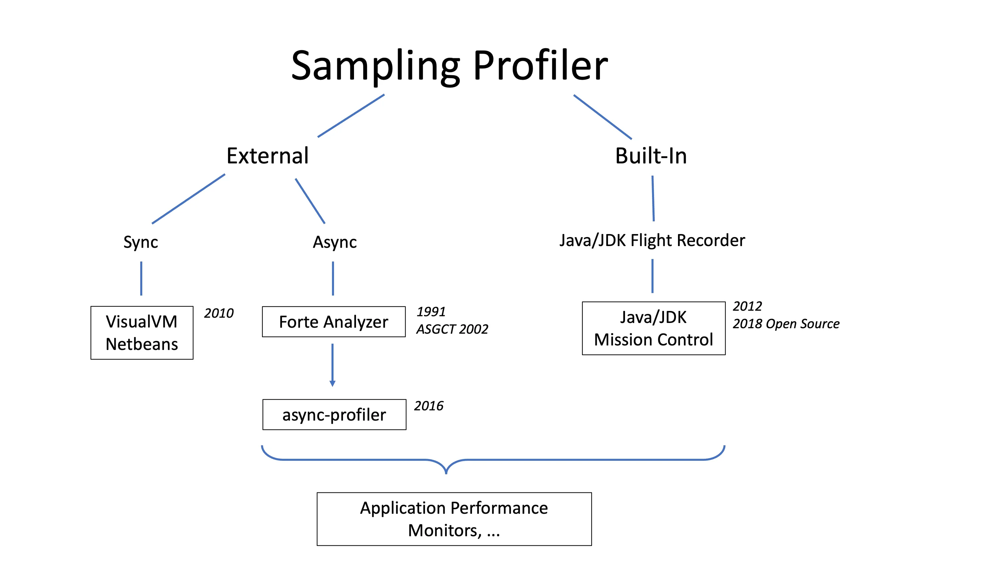

# Java 11 (LTS)

[Oracle](https://www.oracle.com/java/technologies/javase/11-relnote-issues.html), [OpenJDK](https://openjdk.org/projects/jdk/11/)

- LTS after Java8
- No free lts support by Oracle
- OpenJDK

<hr>

### String Class

- isBlank()
- lines()
- strip()
- stripLeading
- stripTrailing
- repeat

<hr>

### New File Methods

- Files.writeString()
- Files.readString()

<hr>

### Collection to Array

- toArray()

<hr>

### Not Predicate

- Predicate.not()

<hr>

### Var in Lambda

- @Nonnull (var x) -> x.toUpperCase()

<hr>

### No need to compile

previous versions:

```shell
javac Miscellaneous.java
java Miscellaneous
```

now:

```shell
java Miscellaneous.java
```

<hr>

### No Op garbage collector

- Epsilon
- Experimental feature
- No-Op (No Operations)
- Usage:
    - ! Production
    - Performance testing
    - Memory Pressure testing
    - VM interface testing
    - ...

- enable:

```shell
-XX:+UnlockExperimentalVmOptions 
-XX:+UseEpsilonGC
```

<hr>

### JFR

- Java Flight Recorder
- Profiling tool
- open sourced in OpenJDK
- commercial in Oracle JDK
- JMC (Java Mission Control)

<hr>

### JavaEE and Corba

- java9: Deprecated
- java11: Removed
    - `java.corba`
    - `java.transaction`
    - `java.xml.ws`
    - `java.xml.ws.annotation`
    - `java.xml.bind`
    - `java.activation`
    - ...

<hr>

### JDK, JMC, JavaFX

- standalone
- seperated
- [JDK Mission Control Tutorial](https://github.com/thegreystone/jmc-tutorial)
- [JMC 9.0.0 General-Availability Release](https://jdk.java.net/jmc/9/)



[Unleash the Power of Open Source Java Profilers: Comparing VisualVM, JMC, and async-profiler](https://www.infoq.com/articles/open-source-java-profilers/)

